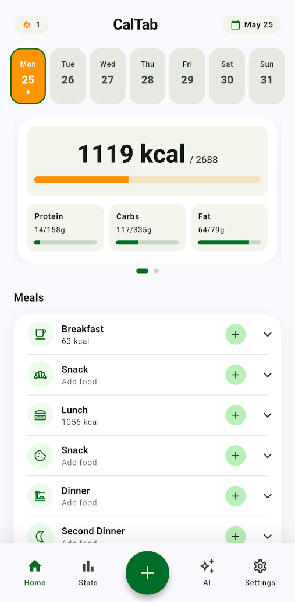

# CalTab

A privacy-first calorie and macro tracker built with Flutter. All user data — profile, food log, settings — lives on the device via `shared_preferences`; only food searches and (optionally) AI features hit the network. Foods come from the [Open Food Facts](https://world.openfoodfacts.org) API, and an optional Gemini integration powers an in-app assistant and Snap2Cal (photo → estimated nutrition).

CalTab is the group project for the *Mobile Applications* module (THWS / TAMK, 2026).

## Features

- **Onboarding** — collects age, height, weight, sex, activity level, and goal; computes BMR/TDEE and daily macro targets.
- **Home** — daily calorie ring, macro tiles, meal accordions (breakfast/lunch/dinner/snack), and a horizontal day picker to back-log meals.
- **Food search** — paginated Open Food Facts search with infinite scroll.
- **Barcode scan** — camera + Google ML Kit, falls back to Open Food Facts lookup.
- **Snap2Cal** — take a photo, Gemini Vision estimates the food and its macros.
- **AI assistant** — in-app chat backed by Gemini (BYOK: bring your own API key).
- **Stats** — 7-day calorie trend, macro averages, meal consistency.
- **Backup** — JSON export/import of profile, meals, and settings.
- **Theming** — system / light / dark, persisted across launches.

## Setup

### Requirements

- Flutter SDK with Dart `^3.11.4` (Flutter 3.35+ stable).
- Xcode (for iOS) and/or Android Studio with an emulator.
- Optional: a [Google AI Studio API key](https://aistudio.google.com/app/apikey) if you want to use the AI assistant or Snap2Cal.

### Run

```bash
cd cal_tab
flutter pub get
flutter run
```

The app starts in onboarding on first launch. Once set up, the AI screen and the Snap2Cal button stay disabled until you paste a Gemini API key in **Settings → AI Assistant**. The key is stored via `flutter_secure_storage`.

### Tests

```bash
flutter test
```

The suite covers model serialization, validators, providers (including pagination), repositories, services, and widget tests across the main screens.

## Architecture

Layered, with each concern in its own folder under `lib/`:

```
lib/
  app/           # router, theme, app shell
  models/        # data classes (fromJson/toJson)
  repositories/  # SharedPreferences / secure-storage wrappers
  services/      # HTTP clients, calculators, AI, backup
  providers/     # Riverpod notifiers / async notifiers
  screens/       # one screen per file
  widgets/       # reusable UI building blocks
  utils/         # validators and small pure helpers
```

State is managed with **Riverpod 3** (`AsyncNotifier` for async flows, `Notifier` for synchronous state). Navigation is **go_router** with named routes.

## Main packages

| Package | Why |
|---|---|
| `flutter_riverpod` | State management — async notifiers for data fetching, sync notifiers for settings/profile. |
| `go_router` | Declarative named routing; type-safe extras for the food-detail flow. |
| `http` | Open Food Facts REST calls. |
| `shared_preferences` | Local persistence for profile, meals, and settings. |
| `flutter_secure_storage` | Stores the Gemini API key off-disk-plaintext. |
| `camera`, `google_mlkit_barcode_scanning` | Barcode scanning. |
| `image_picker`, `google_generative_ai` | Snap2Cal photo flow and AI assistant. |
| `file_picker` | Backup import file selection. |
| `flutter_markdown_plus` | Renders AI assistant replies as Markdown. |

## Screenshots

_Place runtime screenshots in `docs/screenshots/` and reference them here before submission._



## Team

See [`../STUDENTS.md`](../STUDENTS.md).
